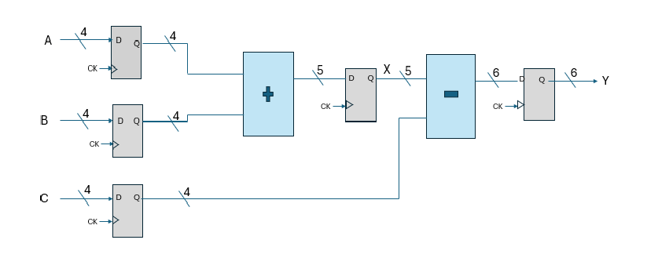

# 4-Bit ALU Design – VLSI Final Project

This project presents a complete design of a 4-bit Arithmetic Logic Unit (ALU), implemented in Cadence Virtuoso using the gsclib045 standard cell library.

The ALU performs arithmetic operations (ADD, SUB) using a tree-based adder architecture, and includes hierarchical schematic design, layout of the adder, and full DRC/LVS verification.

📄 For full implementation details, results, and images, [click here to view the final report](./report.pdf).
