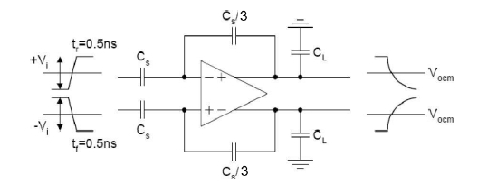

# Fully Differential Amplifier with Gain Boosting

This project implements a high-performance fully differential amplifier using a folded cascode topology with gain boosting. The design was developed in BiCMOS8HP and optimized for gain, bandwidth, stability, and noise performance.

## ✅ Key Results

| Metric                | Achieved         |
|-----------------------|------------------|
| Gain                 | 95.8 dB          |
| GBW (Gain-Bandwidth) | 108.1 MHz        |
| Phase Margin         | 88°              |
| Slew Rate            | 70 V/μs          |
| Dynamic Range        | 80.05 dB         |
| Settling Time        | 41 ns            |
| Power Consumption    | 6.29 mW          |

## 🧠 Highlights

- Gain boosting improves output resistance from 110 kΩ to 20 MΩ  
- Excellent common-mode rejection (CMRR ≈ 250 dB)  
- Clean transient and step response  
- Careful layout and feedback design for noise reduction  

📄 For full analysis and circuit schematics, see the [full design report (PDF)](./Report.pdf)
