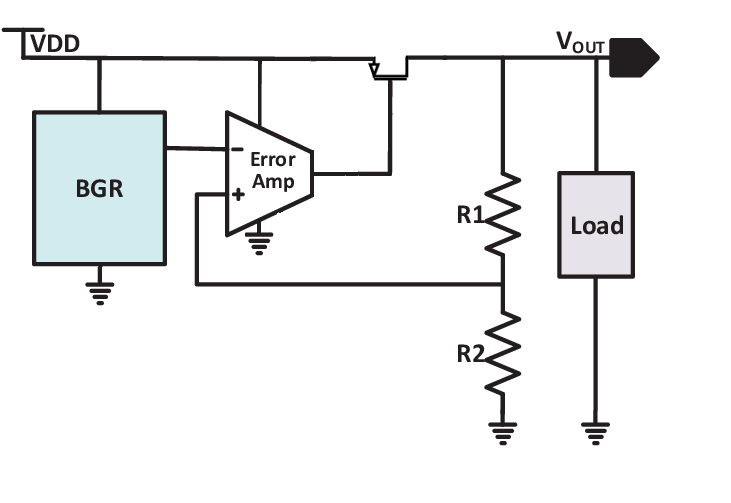
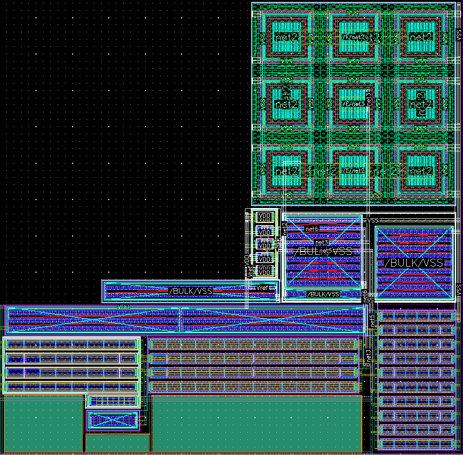
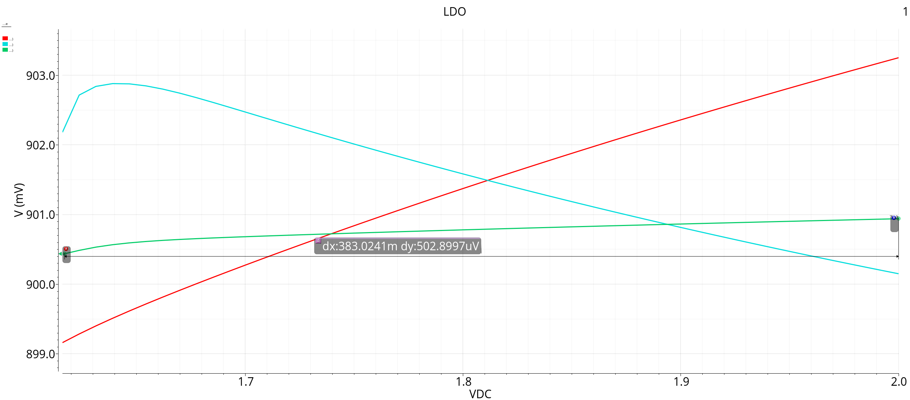
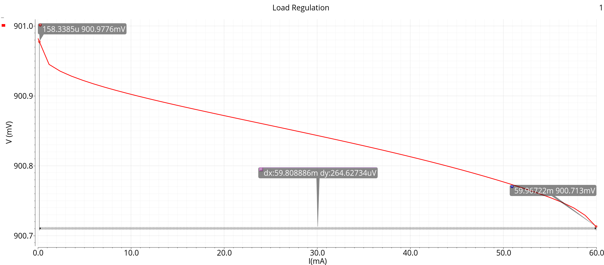

# LDO for a Digital Phase-Locked Loop (TSMC 28nm)

A low-dropout regulator designed to provide a stable, low-noise supply for a high-frequency DPLL system, ensuring accurate timing and minimal phase noise.

## Motivation & Objective
To ensure low jitter and phase noise, the DPLL requires a regulated 0.9V output stable across supply and temperature variations. This LDO is optimized for those constraints, using a compact two-stage OTA and a modified bandgap reference.

## Operating Principle
- **Bandgap Reference (BGR):** Generates a temperature-independent voltage using a combination of PTAT and CTAT currents.
- **OTA (Error Amplifier):** High-gain (~80dB) Miller OTA adjusts the PMOS pass transistor to regulate output voltage.
- **Feedback Loop:** Monitors Vout and stabilizes it via feedback through a resistive divider.

## Implementation Details
- Designed in **Cadence Virtuoso** using **TSMC 28nm PDK**
- Full schematic, layout, LVS & DRC verification
- Layout optimized using **dummy devices**, **common-centroid**, and matching techniques

## Key Results

| Metric                  | Value         |
|------------------------|---------------|
| Output Voltage (Vout)   | 0.9 V         |
| Reference Voltage (Vref)| 0.72 V        |
| Max Load Current (Iload)| 60 mA         |
| Line Regulation         | 0.001         |

## Figures

| Description                          | Image Preview                   |
|--------------------------------------|---------------------------------|
| **LDO Block Diagram**                |    |
| **Layout Screenshot**               |          |
| **Line Regulation vs. VDD**         |  |
| **Load Regulation vs. Iload**       |  |

## Contributors
Or Fahima, Arsen Arutyunov  
Advisor: Tal Elazar  
Project No: 24-1-1-3097
