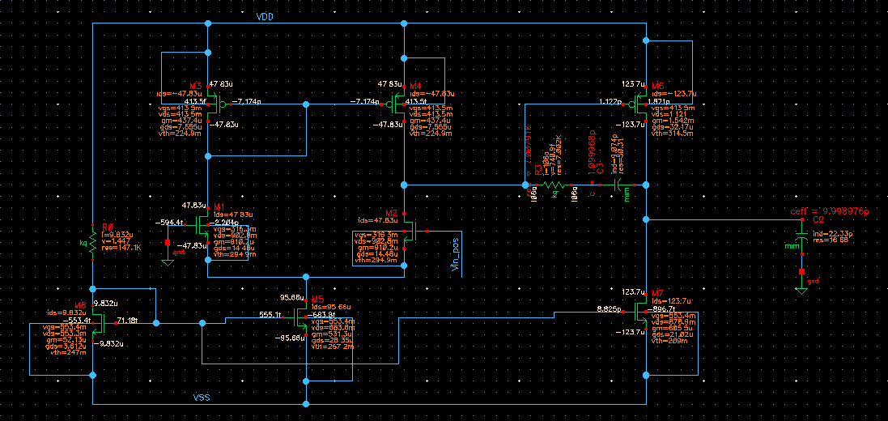

# CMOS OTA Design – BiCMOS8HP Technology

This project presents the design and simulation of a high-performance CMOS Operational Transconductance Amplifier (OTA), implemented in the IBM 45nm BiCMOS8HP process.

## 🔧 Project Goals
- Achieve target specifications for **gain**, **bandwidth**, **phase margin**, and **power**.
- Optimize the design for performance vs. power trade-offs.
- Explore full analog IC design flow: schematic, simulation, and analysis.

## 📈 Final Results
| Parameter         | Target     | Achieved        |
|------------------|------------|-----------------|
| Gain (A0)         | 60 dB      | 61.49 dB         |
| GBW               | 100 MHz    | 107.5 MHz        |
| Phase Margin (PM) | > 45°      | 49°              |
| Power Consumption | –          | 458 µW           |
| Output Swing      | –          | ±0.884 V         |
| Slew Rate         | –          | ~81–86 V/µs      |
| Input Impedance   | High       | ~8 GΩ            |
| Output Impedance  | –          | ~47.5 kΩ         |

## 🧩 Block Diagram

## 📄 Full Report
For detailed circuit description, simulations (AC/DC, transient, CMRR, noise), and design decisions – see the [Full Report (PDF)](./report.pdf).
